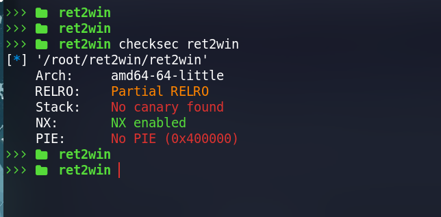
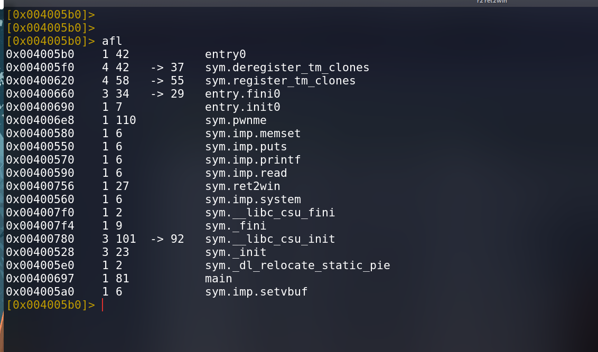
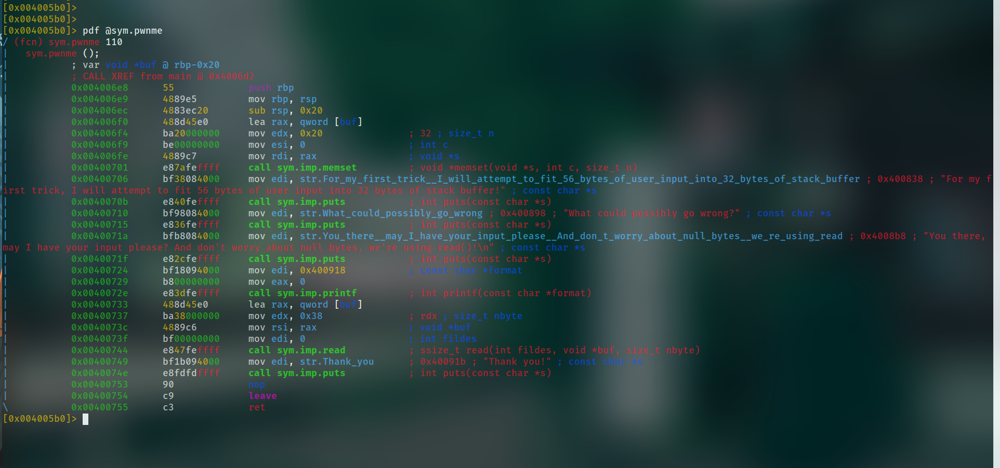
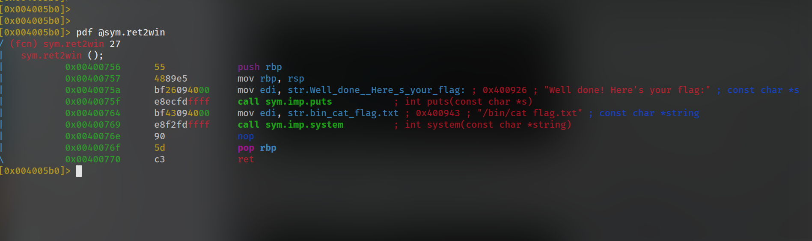
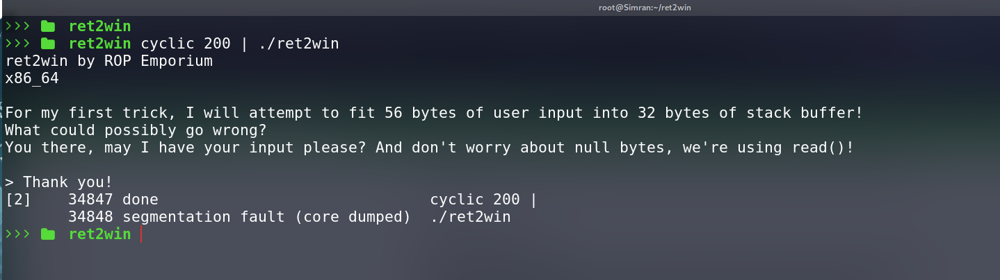
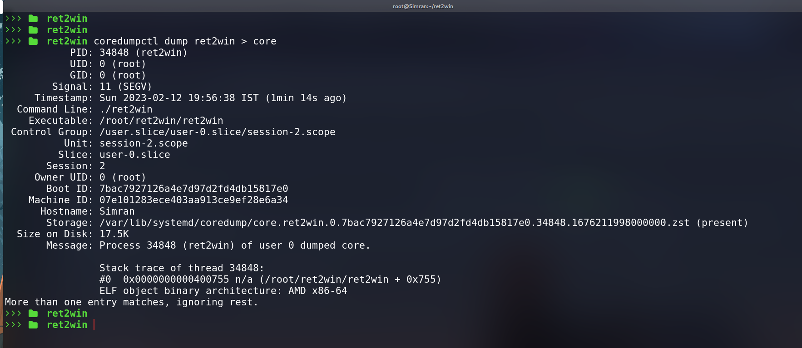
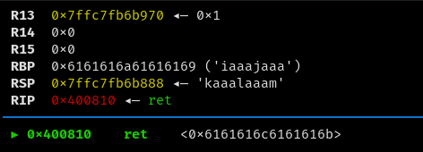
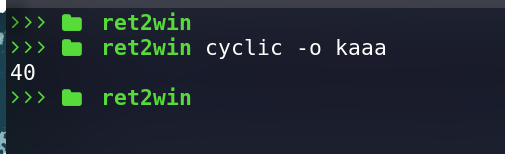

# ret2win

## Recon
As always in order to solve any problem we must recon the problem and then understand it so that we can effectively write a solution.

## Checksec
Running checksec on the binary reveals that the binary has only nx enabled and hence it is quite easy to exploit.



## Static analysis
Opening the  functions in radare2 


 
 `Main` Function :
 
 

we can see it’s just calling pwnme function which seems vulnerable.

`pwnme` Funtion :



`pwnme` function is reading input from stdin of size `56` meanwhile the buffer is of size `32` and 
 hence we have a classic buffer overflow vulnerability here and we can exploit it quite easily.
 
 `ret2win` Function :
 
 

we can see one function is quite interesting which is never called in main or in pwnme function that is ret2win.
Disassembling the function in radare2 we can see clearly that this function is the win function of which the challenge talks.

And we have found the address of the ret2win function as `0x00400756`

## Exploitation
In order to exploit this challenge we must find the offset in our payload at which we can overwrite the RIP 
so that we can control the RIP. After we have found the offset we can simply overwrite the RIP with the address of ret2win function.

## Finding offset

We can use `cyclic` tool from pwntool to generate a cyclic pattern and pass it to the binary to crash it 
and hence generate a coredump which we can analyze to find the offset.



now we can use `coredumpctl` to get the coredump of the binary.



now opening the coredump in `gdb` we found the pattern which overwrote the RIP.



now again using cyclic to find the offset.



## Exploit writing
we can just craft the payload using python to exploit this challenge as the payload is quite small.

```sh
$ python3 -c 'from pwn import *; print("A"*40 + "\x3e\x05\x40\x00\x00\x00\x00\x00" + "\x56\x07\x40\x00\x00\x00\x00\x00")
' | ./ret2win
```


