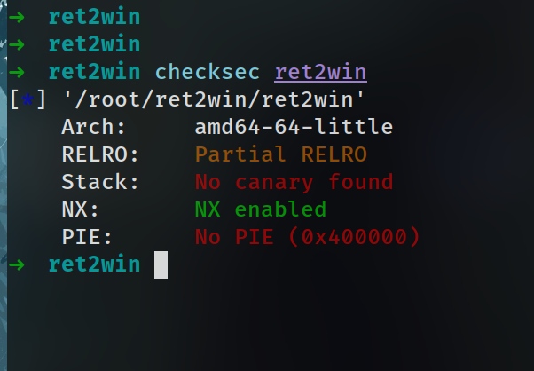
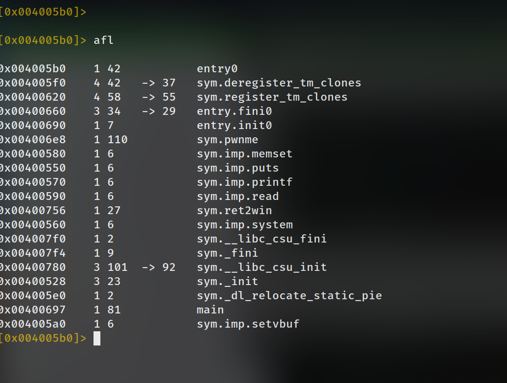
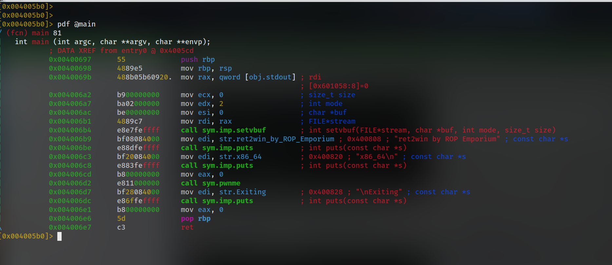

# ret2win

## Recon
As always in order to solve any problem we must recon the problem and then understand it so that we can effectively write a solution.

## Checksec
Running checksec on the binary reveals that the binary has only nx enabled and hence it is quite easy to exploit.

## Static analysis
Opening the main function in radare2 we can see it’s just calling pwnme function which seems vulnerable.

 
 Main Function :
 
 
